# Stock Market Price Prediction using Supervised Learning

### Problem Statement: 

* Predicting how the stock market will perform is one of the most difficult things to do. There are many factors involved in the stock price prediction – general market behavior, company performance, company financial stability, market sentiment and many more. All these aspects combine to make share prices volatile and very difficult to predict with a good degree of accuracy.

* Using features like the latest announcements about an organization, quarterly revenue results, etc., machine learning techniques have the potential to recognize patterns and insights will be used to make predictions.

### Context:

* Stock market analysis is divided into two parts – Fundamental Analysis and Technical Analysis.
    - Fundamental Analysis involves analyzing the company’s future profitability on the basis of its current business environment and financial performance.
    - Technical Analysis, on the other hand, includes reading the charts and using statistical figures to identify the trends in the stock market.

* For stock market prediction, we will focus on the historical stock data analysis part. We’ll be using a dataset available from yahoo financial portal.  

### Criteria for success:

For stock market prediction, focus will be on the individual stock historical dataset from yahoo. 

### Scope of solution space: 

* For stock market prediction, roughly 10 years of daily stock close price of a publicly listed company will be used for analysis.

* Predict the future stock price of JPM starting with simple algorithms like linear regression, Polynomial Regression Model and then move on to advanced techniques like ARIMA, Auto ARIMA, LSTM and FB Prophet Model.

### Constraints:

For stock market prediction, focus will be on the historical stock price. Unexpected or unforeseen change in stock prediction due to situations like natural calamities, pandemic, war and or change in government trade policies impact on market sentiments or behavior. 

 
### Data sources: 
- Finance.yahoo.com

### Tools used:
- Development Environments
    - Visual Studio
    - Jupyter Notebook

- Version Control
    - GitHub - version control
## Stock Prediction Algorithms:

### Linear and Polynomial Regression Model:

Stock Prediction linear forecast line fit:

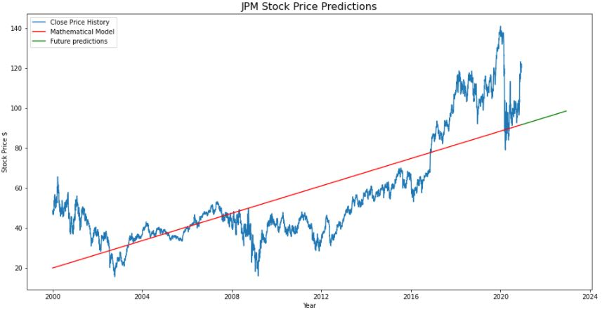 

Model Performance Matrix:

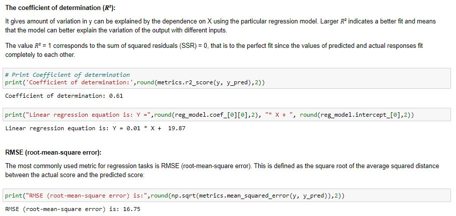 
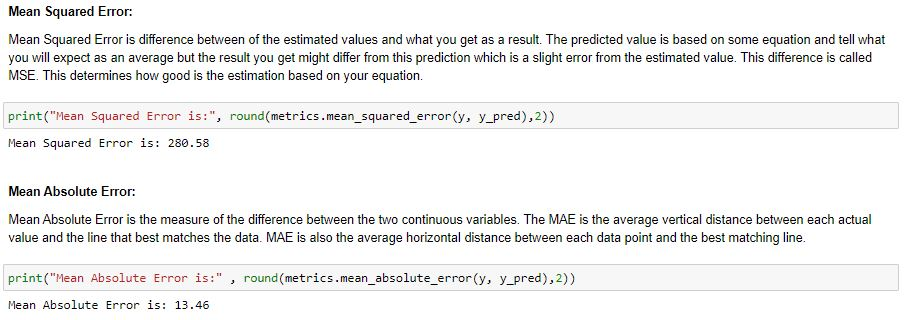

#### Conclusion:

- X-axis of the graph shows the dates from 2002 through 2020 and the Y-axis shows the market closing price.

- The graph in the blue color displays the close price history from year 2002 to year 2020. The graph in the red represents the best fit linear equation for the known data. The graph in the green is the future predictions for next two years.

- As we know linear regression line has positive slope means price will go up which is simply not realistic. Note that we have used only date as a feature to predict the stock price. A simple linear equation with first degree polynomial y = mx + c cannot realistically mimic the stock market behavior.

-JPM Closing price on 2022-12-09 would be around $98.57

### Polynomial Regression Model:
- Polynomial regression fits a nonlinear relationship between the independent variable values and the corresponding conditional mean of the dependent variable.

- Let's try a polynomial equation of degree three as a mathematical model. Let's see, how does it perform and what are its predictions. The equation of degree three is 𝑓(𝑥) = 𝑏₀ + 𝑏₁𝑥 + 𝑏₂𝑥² + 𝑏₃𝑥³

Stock Prediction polynomial forecast line fit:

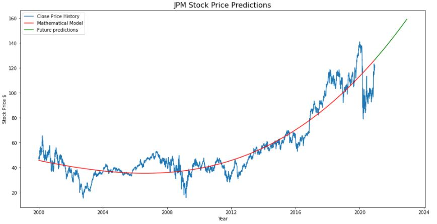

#### Conclusion:

- JPM Stock price on 2022-12-09 would be $159.13

- I think we have moved a little bit closer to reality in terms of fitting the curve. Model shows the stock price will increase over a period of time.

- Will this be reality? Probably not, we need to look at techniques like FB prophet, ARIMA or LSTM to do the time series predictions.

- These stats don't really tell us much by themselves. We may get an intuition for r-squared so that may give you a level of confidence in the models. However, even this metric has problems not to mention does not tell us much about the practicality of this signal from a trading point of view.

### Stacked LSTM Model

- The Long Short-Term Memory, or LSTM, network is a type of Recurrent Neural Network (RNN) designed for sequence problems. In stacked LSTM,  layers are stacked one on top of another into deep recurrent neural networks.

Predicted ~ Actual stock data:

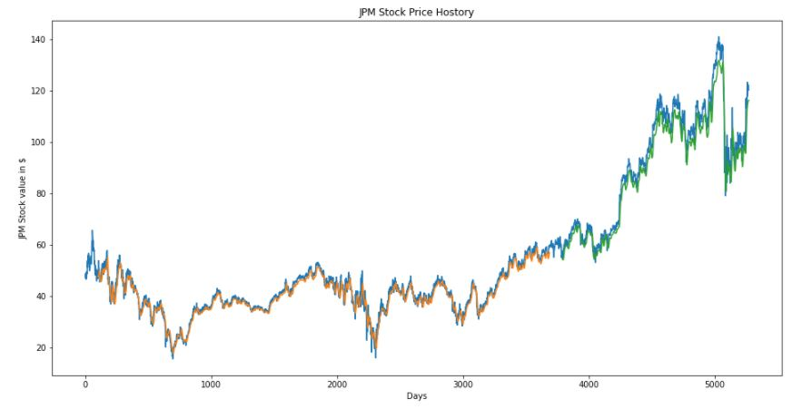

30 Day JPM stock forecast view:

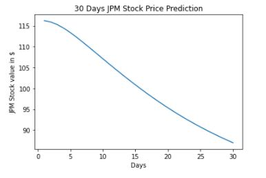

Stock prediction with original stock data

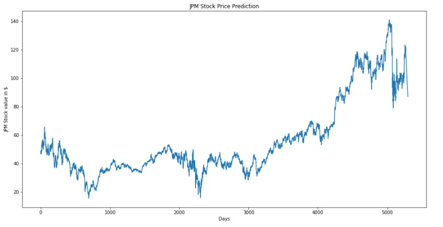

### Conclusion:

- In the LSTM stacked model, we used a 100 day time step to predict 101st day stock price and so on. Error in first day prediction will multiply  for the subsequent days resulting in the overall wrong prediction. 
-  Model predicts JPM stock price 01/08/2021 will be $86.96. Model shows a downward stock price prediction.

### FB Prophet Model:
- Prophet is open source software released by Facebook and commonly used procedure for forecasting time series data based on an additive model where non-linear trends are fit with yearly, weekly, and daily seasonality, plus holiday effects. It works best with time series that have strong seasonal effects and several seasons of historical data. It provides us with the ability to make time series predictions with good accuracy using simple intuitive parameters.

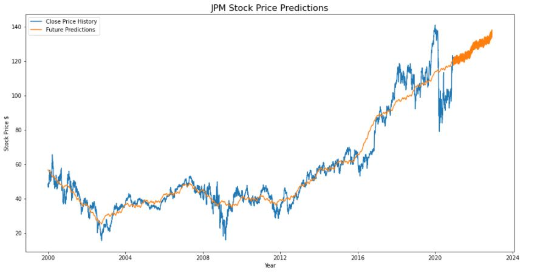

#### Conclusion:

- FB Prophet time series forecasting algorithms did not yield dramatically different result.Stock prediction is too complex to be solved by simple techniques.

- JPM Closing price on 2022-12-10 would be around $134.38

### ARIMA (AutoRegressive Integrated Moving Average) Model:
* 'Auto Regressive' in ARIMA means it is a linear regression model that uses its own lags as predictors. Linear regression models, as you know, work best when the predictors are not correlated and are independent of each other.

* An ARIMA model is characterized by 3 terms: p, d, q where,

- p is the order of the Auto Regressive term
- q is the order of the Moving Average term
- d is the number of differencing required to make the time series stationary

* Making a series stationary:
- The most common approach is to difference it. That is, subtract the previous value from the current value. Sometimes, depending on the complexity of the series, more than one difference may be needed.

- The value of d, therefore, is the minimum number of differencing needed to make the series stationary. And if the time series is already stationary, then d = 0.

* 'p' and 'q' terms:

- 'p' is the order of the 'Auto Regressive' (AR) term. It refers to the number of lags of Y to be used as predictors.
- 'q' is the order of the 'Moving Average' (MA) term. It refers to the number of lagged forecast errors that should go into the ARIMA Model.

- Check Model is stationary with 1st differencing:
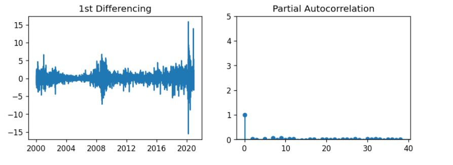

ARIMA Model Result:

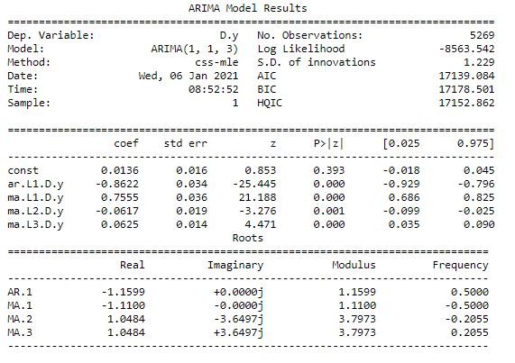

Residual and density:

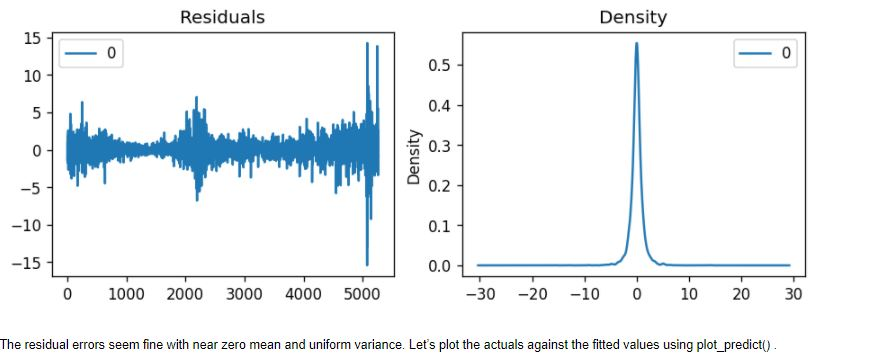

#### Auto ARIMA Model:

- Let's try auto arima model to find optimal p,d and q values

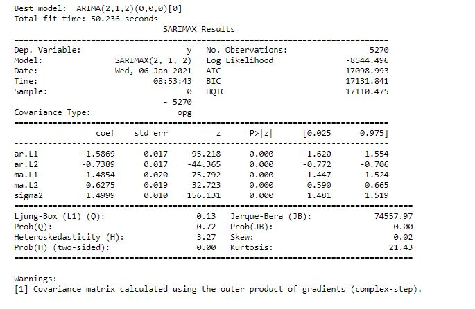

Stock Price Prediction:

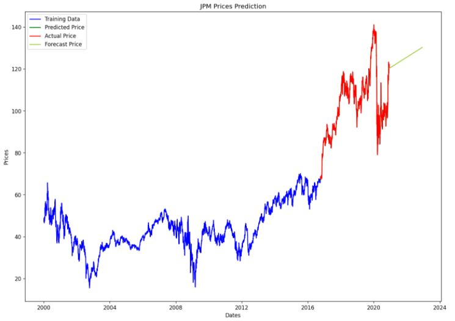
 
#### Conclusion:
##### Linear Regression:
- RMSE (root-mean-square error) is: 16.75
- Mean Absolute Error is: 13.46
- JPM Closing price on 2022-12-09 would be around  $98.57

##### Polynomial Regression:
- RMSE (root-mean-square error) is: 9.59
- Mean Absolute Error is: 7.19
- JPM stock predicted closing price on 2022-12-09 is $159.13

##### FB Prophet:
- RMSE (root-mean-square error) is: 7.05
- Mean Absolute Error is: 4.83
- JPM predicted closing price on 2022-12-09 is $138.32

##### Stacked LSTM:
- RMSE (root-mean-square error) is: 95.0
- Mean Absolute Error is: 92.34
- JPM stock predicted closing price on 2021-01-08 is $131.0

##### ARIMA Model:
- RMSE (root-mean-square error) is:20.65
- Mean Absolute Error is:16.33
- JPM stock predicted closing price on 2022-12-09 is $130.27

### Summary:
- Linear Model: JPM Closing price on 2022-12-09 would be around $98.57
- Polynomial Model:- JPM Stock price on 2022-12-09 would be around $159.13
- Stacked LSTM Model: JPM stock price 21-01-08 will be $86.96. Model shows a downward stock price prediction.
- FB Prophet Model: JPM Closing price on 2022-12-10 would be around $134.38
- Auto Arima Model: JPM Closing price on 2022-12-09 would be around $130.27

#### The Root-Mean-Square Error (RMSE): 
- RMSE is a measure frequently used for assessing the accuracy of prediction obtained by a model. It measures the differences or residuals between actual and predicted values. The metric compares prediction errors of different models for a particular data and not between datasets.

#### Mean Absolute Error (MAE): 
- MAE measures the average magnitude of the errors in a set of predictions, without considering their direction. It’s the average over the test sample of the absolute differences between prediction and actual observation where all individual differences have equal weight.

- The ARIMA and LSTM algorithms that were developed for forecasting the time series are based on rolling forecasting. The rolling forecasting  focuses on a single forecast, i.e., the next data point to predict, for each data set. 

- Comparing all the models, FB Prophet model gave the lowest RMSE of 7.05 and  Mean Absolute Error is: 4.83

- FB Prophet  Model predicted JPM stock closing price on 2022-12-09 will be $138.32

#### Credits
- Medium.com 
- Towardsdatascience.com 
- Krish Naik
- Selva Prabhakaran
- Silvia Seceleanu (Mentor)
- Many more